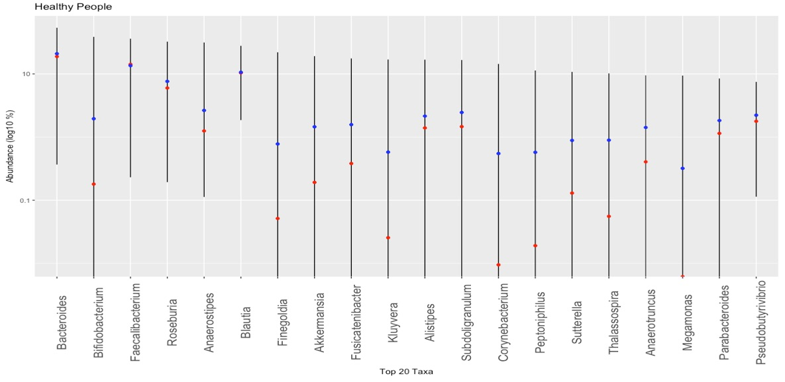

# PSI Utilities for R

This is an R package for doing analysis on microbiome files.

Important files:

* [Healthy Ranges](./healthy_ranges.csv): a CSV list of all genus-level taxa and the ranges as found in healthy people.

